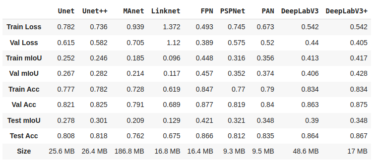

# Drone Images Segmentation

### Dataset:

Aerial Semantic Segmentation Drone Dataset: https://www.kaggle.com/datasets/bulentsiyah/semantic-drone-dataset
### Libraries:

```
!pip install git+https://github.com/qubvel/segmentation_models.pytorch
!pip install --upgrade transformers
```

### Architectures:


### Results:

Architecture | paper | docs | file |
--- | --- | --- |------|
Unet | https://arxiv.org/pdf/1505.04597.pdf | https://smp.readthedocs.io/en/latest/models.html#unet |  |
Unet++ | https://arxiv.org/pdf/1807.10165.pdf | https://smp.readthedocs.io/en/latest/models.html#id2 |  |
MAnet | https://ieeexplore.ieee.org/stamp/stamp.jsp?tp=&arnumber=9201310 | https://smp.readthedocs.io/en/latest/models.html#manet |  |
Linknet | https://arxiv.org/pdf/1707.03718.pdf | https://smp.readthedocs.io/en/latest/models.html#linknet |  |
FPN | http://presentations.cocodataset.org/COCO17-Stuff-FAIR.pdf | https://smp.readthedocs.io/en/latest/models.html#fpn |  |
PSPNet | https://arxiv.org/pdf/1612.01105.pdf | https://smp.readthedocs.io/en/latest/models.html#pspnet |  |
PAN | https://arxiv.org/pdf/1805.10180.pdf | https://smp.readthedocs.io/en/latest/models.html#pan |  |
DeepLabV3 | https://arxiv.org/pdf/1706.05587.pdf | https://smp.readthedocs.io/en/latest/models.html#deeplabv3 |  |
DeepLabV3+ | https://arxiv.org/pdf/1802.02611.pdf | https://smp.readthedocs.io/en/latest/models.html#id9 |  |


### Transformer:
SegFormer: Simple and Efficient Design for Semantic Segmentation with Transformers: https://deepai.org/publication/segformer-simple-and-efficient-design-for-semantic-segmentation-with-transformers

blog: https://medium.com/geekculture/semantic-segmentation-with-segformer-2501543d2be4

file: segmentation_with_transformer_new.ipynb
